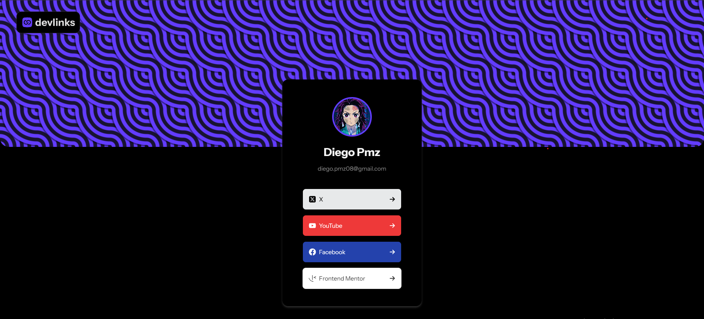

# DevLinks :paperclip:

DevLinks is a platform that allows users to efficiently manage and share links. Users can add links from various social platforms, organize them for easy reference, and utilize drag-and-drop functionality for sorting. The app offers a clean, fast interface optimized with React and Tailwind CSS.

## Table of Contents :clipboard:

- [DevLinks :paperclip:](#devlinks-paperclip)
  - [Table of Contents :clipboard:](#table-of-contents-clipboard)
  - [Overview :book:](#overview-book)
    - [Screenshot :camera:](#screenshot-camera)
    - [Live Demo :rocket:](#live-demo-rocket)
  - [Features :sparkles:](#features-sparkles)
  - [Tech Stack :hammer:](#tech-stack-hammer)
    - [Frontend:](#frontend)
    - [Development Tools:](#development-tools)
  - [Setup \& Installation ⚙️](#setup--installation-️)
  - [Usage :vertical_traffic_light:](#usage-traffic_light)
  - [Project Structure :file_folder:](#project-structure-file_folder)

---

## Overview :book:

This project implements a **link-sharing application** where users can add, manage, and display their favorite links. The challenge emphasizes responsive design and robust functionality.

### Screenshot :camera:



### Live Demo :rocket:

Check out the live application [here](https://devlink-frontend.vercel.app/).

---

## Features :sparkles:

- Responsive design for mobile, tablet, and desktop.
- Supports multiple link platforms.
- Real-time feedback on link validity and usability.

---

## Tech Stack :hammer:

### Frontend:

- **React (18.3.1)**: UI library for building dynamic components.
- **Vite**: Modern build tool for fast development and hot module replacement.
- **Tailwind CSS**: Utility-first CSS framework for responsive, customizable styling.
- **Zustand**: Simple and lightweight state management library.
- **Dnd-kit**: Drag-and-drop functionality for interactive UI elements.
- **React Icons**: Icon library for adding scalable vector icons to React components.

### Development Tools:

- **TypeScript**: For type-safe development and enhanced editor support.
- **Jest & Testing Library**: Unit and integration testing.
- **ESLint & Prettier**: Code linting and formatting.
- **Zod**: Schema validation library for input and API responses.

---

## Setup & Installation ⚙️

Follow these steps to get the project running locally:

1. **Clone the repository**:
   ```bash
   git clone https://github.com/DiegoPMz/devlink-frontend.git
   cd devlink-frontend
   ```
2. **Install dependencies**:
   - Use the following command to install all the required packages.
   ```bash
   npm install
   ```
3. **Environment variables**:

   - Create a .env file in the root directory and configure it with the required environment variables

   ```bash
   VITE_API_BASE_URL=https://your-api-url.com
   ```

4. **Run the development server**:

   ```bash
   npm run dev
   ```

---

## Usage :vertical_traffic_light:

- **Manage Links**: Edit or delete links as needed.
- **Responsive UI**: Access the app seamlessly on any device.

---

## Project Structure :file_folder:

src/

├── assets/ # Static assets (images, icons, etc.)

├── components/ # Reusable React components

├── hooks/ # Custom React hooks for encapsulating reusable logic

├── layouts/ # Components that define the structure or layout of the application pages.

├── pages/ # Contains the main page components mapped to routes in the application.

├── schemas/ # Stores schema definitions for data validation and utilities, often using tools like Zod.

├── service/ # Handles API requests and utility functions for server communication.

├── store/ # Implements the application's global state management using Zustand.

├── types/ # Defines TypeScript types and interfaces to ensure type safety across the application.

├── utilities/ # General utility functions used throughout the project.

└── main.tsx # Entry point

---
